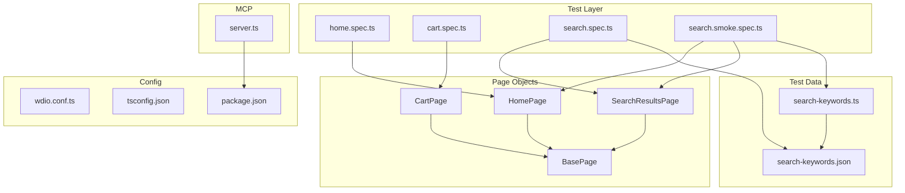

# Singer BD Automation Suite — Codebase Walkthrough

## Overview

A **TypeScript + WebdriverIO v9 + Mocha** test automation framework using the **Page Object Model (POM)** pattern to test the [singerbd.com](https://www.singerbd.com/) e-commerce website. It also includes a small **MCP server** for exposing project metadata over stdio.

---

## Architecture

---

## File-by-File Breakdown

### Page Objects (`src/pages/`)

| File | Class | Key Responsibilities |
|---|---|---|
| [base.page.ts](file:///Users/atiarrahmanchowdhury/Desktop/Singer_BD_Automaiton/src/pages/base.page.ts) | `BasePage` | Reusable helpers: `open()`, `click()`, `type()`, `getText()`, `pickVisible()`. Uses a selector cache for resilience. |
| [home.page.ts](file:///Users/atiarrahmanchowdhury/Desktop/Singer_BD_Automaiton/src/pages/home.page.ts) | `HomePage` | Opens homepage, checks load state, performs search (with toggle-button fallback & URL fallback). |
| [cart.page.ts](file:///Users/atiarrahmanchowdhury/Desktop/Singer_BD_Automaiton/src/pages/cart.page.ts) | `CartPage` | Opens `/checkout/cart/`, determines cart state (`empty` / `items` / `unknown`). |
| [search-results.page.ts](file:///Users/atiarrahmanchowdhury/Desktop/Singer_BD_Automaiton/src/pages/search-results.page.ts) | `SearchResultsPage` | Waits for search URL, counts product cards, reads heading, and detects result or empty state. |

> [!TIP]
> All page classes use **multi-selector arrays** with fallback logic to handle UI/theme changes gracefully — a strong resilience pattern.

### Test Specs (`test/specs/`)

| File | What It Tests |
|---|---|
| [home.spec.ts](file:///Users/atiarrahmanchowdhury/Desktop/Singer_BD_Automaiton/test/specs/home.spec.ts) | Homepage opens and the URL contains `singerbd.com`. |
| [cart.spec.ts](file:///Users/atiarrahmanchowdhury/Desktop/Singer_BD_Automaiton/test/specs/cart.spec.ts) | Cart page opens at `/checkout/cart` and has a valid state (`empty` or `items`). |
| [search.spec.ts](file:///Users/atiarrahmanchowdhury/Desktop/Singer_BD_Automaiton/test/specs/search.spec.ts) | Data-driven test: for each keyword in JSON, navigates directly to search URL and validates results. |
| [search.smoke.spec.ts](file:///Users/atiarrahmanchowdhury/Desktop/Singer_BD_Automaiton/test/specs/search.smoke.spec.ts) | Smoke test: uses `HomePage.search()` to search from the homepage and verifies results appear. |

### Test Data (`test/data/`)

| File | Purpose |
|---|---|
| [search-keywords.json](file:///Users/atiarrahmanchowdhury/Desktop/Singer_BD_Automaiton/test/data/search-keywords.json) | Contains keywords: `"refrigerator"`, `"washing machine"`. |
| [search-keywords.ts](file:///Users/atiarrahmanchowdhury/Desktop/Singer_BD_Automaiton/test/data/search-keywords.ts) | Type-safe wrapper that validates and exports the JSON data. |

### MCP Server (`src/mcp/`)

[server.ts](file:///Users/atiarrahmanchowdhury/Desktop/Singer_BD_Automaiton/src/mcp/server.ts) — A stdio-based MCP server exposing:
- **Resource** `singerbd://docs/readme` — serves the project `README.md`
- **Tool** `list_npm_scripts` — lists npm scripts with optional name filter

### Configuration

| File | Details |
|---|---|
| [wdio.conf.ts](file:///Users/atiarrahmanchowdhury/Desktop/Singer_BD_Automaiton/wdio.conf.ts) | Runner: `local`, Framework: `mocha`, Base URL: `singerbd.com`. Supports env-driven `BROWSER`, `HEADLESS`, `MAX_INSTANCES`, `LOG_LEVEL`, `SPEC_RETRIES`. |
| [tsconfig.json](file:///Users/atiarrahmanchowdhury/Desktop/Singer_BD_Automaiton/tsconfig.json) | Target: ES2022, Module: CommonJS, includes WDIO global types. |
| [package.json](file:///Users/atiarrahmanchowdhury/Desktop/Singer_BD_Automaiton/package.json) | 10 npm scripts covering default/smoke/regression/headless/cross-browser/debug/MCP runs. |

---

## npm Scripts Summary

| Script | Description |
|---|---|
| `npm test` | Default run (currently only `home.spec.ts` in specs array) |
| `test:headless` | Headless Chrome |
| `test:chrome` / `test:firefox` | Explicit browser selection |
| `test:smoke` | Smoke suite (`home.spec.ts`) |
| `test:smoke:fast` | Headless + 3 workers + warn log |
| `test:regression` | Regression suite (`home.spec.ts`) |
| `test:regression:fast` | Headless + 4 workers + warn log |
| `test:debug` | Debug log level |
| `mcp:server` | Start MCP server over stdio |

---

## Key Patterns & Design Decisions

1. **Multi-selector resilience** — Every page object stores arrays of CSS selectors for each element, iterating to find whichever matches. `BasePage.pickVisible()` adds caching for performance.
2. **Fallback strategies** — `HomePage.search()` tries the UI first, then falls back to direct URL navigation if the search input can't be found.
3. **Data-driven tests** — `search.spec.ts` loops over keywords from an external JSON file, generating one `it()` block per keyword.
4. **Env-var driven configuration** — Parallelism, browser, headless mode, log level, and retries are all configurable via environment variables without touching config files.
5. **Singleton page instances** — Each page object file exports `new PageClass()`, providing a singleton pattern.

---

## Notable Observations

> [!IMPORTANT]
> The `specs` array and both `suites` (smoke & regression) in `wdio.conf.ts` currently only reference `home.spec.ts`. The `cart.spec.ts`, `search.spec.ts`, and `search.smoke.spec.ts` files exist but **aren't included** in any suite or the default spec list.

> [!NOTE]
> The `BasePage` constructor has an unused `selectorCache` that only benefits long-lived page object instances — this works because pages are exported as singletons.

---

## Statistics

| Metric | Value |
|---|---|
| Total source files | 14 (excluding `node_modules`, `.git`) |
| Page objects | 4 |
| Test specs | 4 |
| Test data files | 2 |
| npm scripts | 10 |
| Dependencies | 2 (runtime) + 8 (dev) |
| Target website | singerbd.com |
